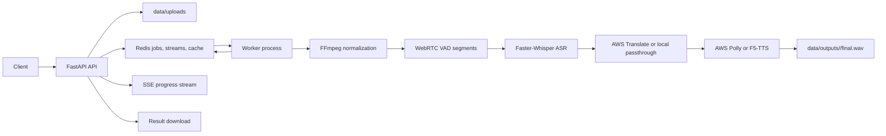

# dubTTS

An asynchronous speech dubbing MVP built with FastAPI, Redis Streams, Whisper ASR, AWS Translate, and AWS Polly. It accepts an audio or video file, splits speech into segments, transcribes each segment, translates the text, synthesizes target-language audio, and stitches the dubbed result back into a WAV file.

The service is designed as a small production-style pipeline: the API returns immediately with a job id, background workers process jobs from Redis, and clients can follow progress in real time through Server-Sent Events.

## Features

- Upload audio or video files for asynchronous dubbing jobs
- Redis-backed job state, queueing, retries, heartbeats, and event replay
- Real-time job progress with Server-Sent Events
- Audio normalization to 16 kHz mono WAV with FFmpeg
- WebRTC VAD speech segmentation
- Faster-Whisper transcription
- AWS Translate integration with Redis-backed translation caching
- AWS Polly text-to-speech, plus optional F5-TTS Russian provider
- Segment-level and end-to-end latency metrics
- Prometheus metrics endpoint and optional Grafana dashboard
- Pytest coverage for API, Redis backend, regression, and load/performance checks

## Architecture



## Requirements

- Python 3.10 or 3.11 recommended
- Redis 7+
- FFmpeg available on `PATH`
- Docker, if you want to run Redis, Prometheus, or Grafana in containers
- AWS credentials for real translation and Polly synthesis

The project does not currently include a pinned dependency file. Install the runtime packages manually or create your own `requirements.txt` from the imports:

```bash
python -m venv .venv
source .venv/bin/activate
pip install \
  fastapi uvicorn python-multipart aiofiles redis prometheus-client \
  boto3 botocore faster-whisper webrtcvad requests \
  pytest pytest-asyncio httpx
```

Install FFmpeg separately:

```bash
# macOS
brew install ffmpeg

# Ubuntu/Debian
sudo apt-get update
sudo apt-get install -y ffmpeg
```

## Quick Start

Start Redis:

```bash
docker run --rm -p 6379:6379 redis:7-alpine
```

Start the API:

```bash
export REDIS_URL="redis://localhost:6379/0"
export USE_AWS="0"
uvicorn app.main:app --reload
```

Start a worker in another terminal:

```bash
export REDIS_URL="redis://localhost:6379/0"
export USE_AWS="0"
python -m app.worker
```

With `USE_AWS=0`, translation returns the original text and TTS writes placeholder silence WAVs. This is useful for validating queueing, segmentation, status updates, and downloads without cloud credentials.

## Run a Dubbing Job

Create a job:

```bash
curl -F "file=@/path/to/input.wav" \
  -F "src_lang=en" \
  -F "tgt_lang=ru" \
  -F "voice=Tatyana" \
  http://127.0.0.1:8000/v1/dubs
```

Example response:

```json
{
  "job_id": "2fb6b4b3d0d94c01ad89f3f02d4d6c35"
}
```

Check status:

```bash
curl http://127.0.0.1:8000/v1/dubs/<job_id>
```

Stream progress:

```bash
curl -N http://127.0.0.1:8000/v1/dubs/<job_id>/events
```

Download the final WAV when the job is done:

```bash
curl -o result.wav http://127.0.0.1:8000/v1/dubs/<job_id>/result
```

Download a generated segment:

```bash
curl -o segment.wav http://127.0.0.1:8000/v1/dubs/<job_id>/segments/0
```

## API Endpoints

| Method | Path | Description |
| --- | --- | --- |
| `GET` | `/` | Basic service metadata |
| `GET` | `/health` | Health check with Redis connectivity |
| `POST` | `/v1/dubs` | Upload a file and enqueue a dubbing job |
| `GET` | `/v1/dubs/{job_id}` | Read job status |
| `GET` | `/v1/dubs/{job_id}/events` | Stream progress events with SSE |
| `GET` | `/v1/dubs/{job_id}/result` | Download final dubbed WAV |
| `GET` | `/v1/dubs/{job_id}/segments/{segment_index}` | Download an individual dubbed segment |
| `GET` | `/v1/metrics` | JSON performance report |
| `GET` | `/metrics` | Prometheus metrics |

## Configuration

Common environment variables:

| Variable | Default | Description |
| --- | --- | --- |
| `REDIS_URL` | `redis://localhost:6379/0` | Redis connection URL |
| `USE_AWS` | `1` | Set to `0` for local passthrough and placeholder TTS |
| `AWS_REGION` | `eu-west-1` | AWS region for Translate and Polly |
| `AWS_USE_IAM_ROLE` | `auto` | IAM role behavior for AWS credentials |
| `AWS_SECRETS_MANAGER_SECRET_NAME` | empty | Optional AWS Secrets Manager secret for credentials |
| `ASR_MODEL_SIZE` | `small` | Faster-Whisper model size |
| `ASR_DEVICE` | `cpu` | Faster-Whisper device, for example `cpu` or `cuda` |
| `ASR_COMPUTE_TYPE` | `int8` | Faster-Whisper compute type |
| `TTS_PROVIDER` | `aws` | `aws`, `f5_tts_russian`, or `comparison` |
| `F5_TTS_ENABLED` | `false` | Enables local F5-TTS provider checks |
| `F5_TTS_CKPT_DIR` | `./models/f5-tts-russian` | Local F5-TTS checkpoint directory |
| `MATCH_TTS_DURATION` | `false` | Time-stretch or trim TTS output to segment duration |
| `JOB_MAX_ATTEMPTS` | `3` | Maximum worker attempts per job |
| `JOB_CLAIM_IDLE_MS` | `60000` | Idle time before reclaiming stale Redis stream work |
| `WORKER_METRICS_PORT` | `9108` | Worker Prometheus metrics port |
| `LOG_LEVEL` | `INFO` | Logging level |
| `LOG_JSON` | `0` | Set to `1` for JSON logs |

## AWS Mode

For real translation and speech synthesis, keep `USE_AWS=1` and configure credentials through one of the supported mechanisms:

- IAM role on EC2, ECS, or Lambda
- AWS Secrets Manager via `AWS_SECRETS_MANAGER_SECRET_NAME`
- Environment variables such as `AWS_ACCESS_KEY_ID` and `AWS_SECRET_ACCESS_KEY`
- Standard AWS credentials file

The AWS path uses Translate for machine translation and Polly for speech generation. See [AWS_IAM_SECRETS_SETUP.md](AWS_IAM_SECRETS_SETUP.md) for more deployment-oriented credential notes.

## Optional F5-TTS

The TTS provider abstraction can use a local F5-TTS Russian model:

```bash
export TTS_PROVIDER="f5_tts_russian"
export F5_TTS_ENABLED="true"
export F5_TTS_CKPT_DIR="./models/f5-tts-russian"
```

You also need the `f5-tts_infer-cli` command and model files under the checkpoint directory. See [F5_TTS_SETUP.md](F5_TTS_SETUP.md) for setup details.

## Observability

The API exposes Prometheus metrics at:

```text
http://127.0.0.1:8000/metrics
```

The worker exposes metrics on `WORKER_METRICS_PORT`, defaulting to `9108`.

Start Prometheus and Grafana:

```bash
docker compose -f docker-compose.observability.yml up
```

Then open:

- Prometheus: `http://localhost:9090`
- Grafana: `http://localhost:3000` with `admin` / `admin`

See [OBSERVABILITY.md](OBSERVABILITY.md), [PERFORMANCE_METRICS.md](PERFORMANCE_METRICS.md), and [PERFORMANCE_RESULTS.md](PERFORMANCE_RESULTS.md) for more detail.

## Testing

Start Redis first:

```bash
docker run --rm -p 6379:6379 redis:7-alpine
```

Run the test suite:

```bash
pytest tests/ -v
```

Run selected tests:

```bash
pytest tests/test_redis_backend.py -v
pytest tests/test_api_regression.py -v
pytest tests/test_load_performance.py -v
```

Run the standalone load test:

```bash
python tests/load_test_standalone.py --endpoint health --concurrency 10 --requests 5
```

## Project Layout

```text
app/
  main.py              FastAPI routes, SSE, metrics, and result download
  worker.py            Redis Stream worker loop
  pipeline_redis.py    Redis-backed dubbing pipeline
  audio.py             FFmpeg conversion, VAD segmentation, duration matching
  asr.py               Faster-Whisper transcription
  aws_nlp.py           AWS Translate and Polly integration
  tts_providers.py     AWS/F5-TTS provider abstraction
  redis_backend.py     Job store, queue, and event stream helpers
  metrics.py           Runtime and Prometheus metrics
tests/                 Unit, integration, regression, and load tests
observability/         Prometheus and Grafana configuration
data/                  Runtime uploads and generated outputs
```

## Notes and Limitations

- Generated files are written under `data/uploads` and `data/outputs`.
- The first Faster-Whisper run downloads and loads a model, which can take time.
- Real dubbing quality depends on AWS credentials, selected Polly voice, source audio quality, and target language.
- `USE_AWS=0` is a pipeline test mode, not a real dubbing mode.
- There is no pinned dependency manifest yet. Add one before deploying or sharing reproducible environments.

